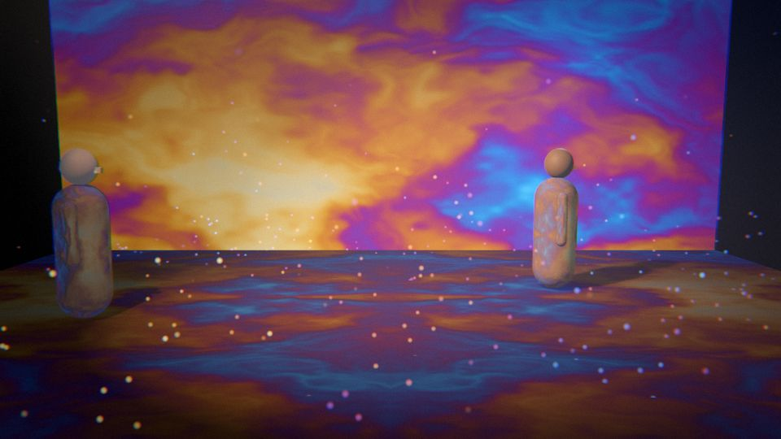
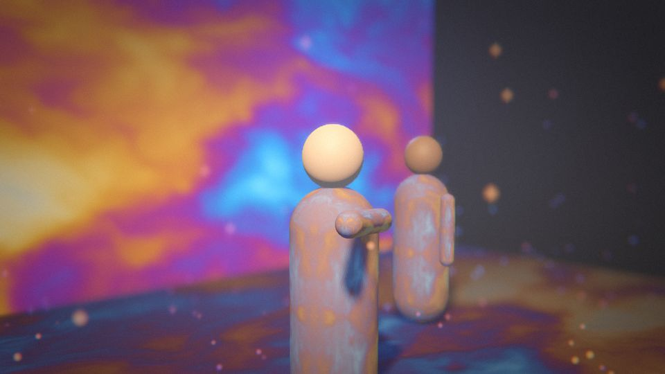
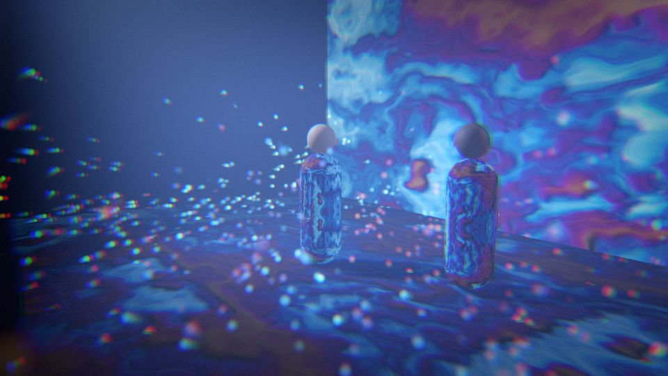
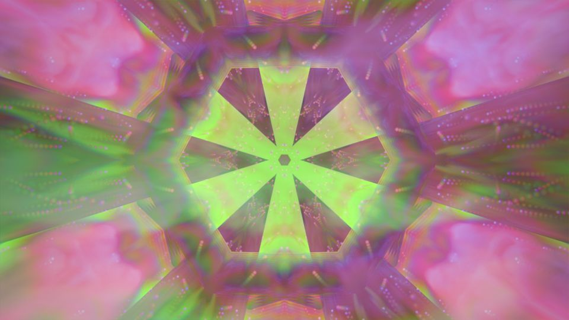
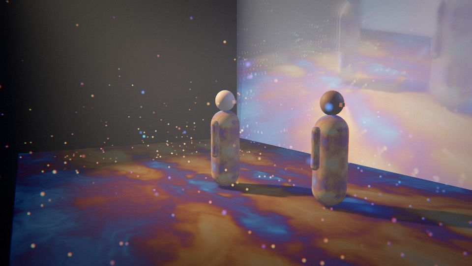

# Proscenium

Animation performed live, like theatre.

Each scene of an animated film is built as a small real-time world in Godot. The characters
perform their blocking like a game cinematic, but on **story time**, which the performer can
slow, hold, loop or step through. Everything else is played live from a MIDI controller (and
later by more people over OSC): the camera, the light, the weather, and textures generated in
real time on the walls, floor and costumes. The performer can also treat the finished image on
top of all that.



| | |
|---|---|
|  |  |
|  |  |

*Frames rendered by the test scene with placeholder figures. The last one sends the rendered
stage, through the feedback patch, onto the stage's own back wall. That's two routing choices,
with no code.*

## Run it

1. Install **Godot 4.4 or newer** (the standard build, not .NET). It was developed against 4.7.1.
2. Open Godot, **Import** this folder's `project.godot`, and press **Play** (F5).
3. Plug in a MIDI controller before launching. The default map is for a **Korg nanoKONTROL2**;
   any controller works once mapped (see below).

No controller? The keyboard and HUD cover everything, and `tools/osc_send.py` pokes any control
from a terminal.

| Key | |
|---|---|
| `Space` | **GO**: release a hold, or move on to the next beat |
| `←` `→` `Home` | previous / next beat / back to the top |
| `P` / `L` | hold the story / loop the current beat |
| `1`–`4`, `Shift`+`1`–`4` | recall / store a look |
| `R` | reset every control to its default |
| `Tab` then `↑` `↓` `-` `=` | control list: pick any control and nudge it |
| `H` / `C` / `F` | hide the HUD / captions, fullscreen |
| `F5` | reload the MIDI map |

## How it's put together

```
MIDI ──┐                                ┌──────────────── Godot ────────────────┐
OSC ───┼──► Bus (every control, by  ───►│ Story   beats on story time          │
keys ──┘     address, 0..1, smoothed,   │ Stage   3D world: actors, light, fog, │
             owned, soft takeover)      │         particles, camera              │
                                        │ Pool    live textures by name          │──► window
OSC ◄──── every change mirrored out     │ Post    lens ─► screen (feedback)      │
                                        └────────────────────────────────────────┘
```

**The bus** (`core/bus.gd`) is the heart of it. Nothing touches the scene directly. Every
input writes a normalized value to an address like `/lens/orbit`, and the scene reads it back
in real units. That one step of indirection gives you:

- **Safety.** Everything is clamped and smoothed, so a wild knob turn can't break a frame.
- **Remapping without code.** `config/midi_map.json` maps controller numbers to addresses.
- **More performers later with no rework.** Every device and every OSC sender is its own
  *source*:
  - A performer can **claim** a prefix (`/lens` for a camera operator), and then no one else
    can move those controls.
  - **Soft takeover:** a control only accepts a new source once it reaches the current value,
    so nothing jumps when two people touch the same thing.

**Story time** (`core/story_player.gd`, `stage/story.json`) plays a scene as **beats**.
- Each beat names an animation per actor, lines of dialogue, a *look* to fade to, and what
  happens at its end: `continue`, `hold` (wait for GO) or `loop`.
- Actors are posed from story time every frame, so slowing, holding, looping and jumping back
  always agree.
- When the story holds, characters don't freeze. An idle animation (breathing, small
  movements) blends in over the body while they stay exactly on their mark.
- Dialogue is per line, so stretching a beat lengthens the silences rather than slowing the
  voices.

**Five layers of live image.** Every layer's parameters are on the bus:

| Layer | What | Where |
|---|---|---|
| 1 Surface | live textures on walls, floor, costumes | `core/surface_binding.gd` |
| 2 World | light, fog, glow, particles | `stage/demo_set.gd` |
| 3 Lens | camera moves, depth of field; distortion, aberration, grain | `core/camera_rig.gd`, `patches/lens.gdshader` |
| 4 Screen | feedback, kaleidoscope, overlays, grade, fade | `patches/screen.gdshader` |
| 5 Room | output to projectors/screens | the window, for now; see roadmap |

**The texture pool** (`core/texture_pool.gd`) is what makes the layers one instrument.
- Every generated image is published under a name: `noise`, `bands`, `feedback`, `stage`,
  `lens`, `screen`.
- Anything on any layer can use any of them. Switching a wall from noise to bands is choosing
  a different name, from a button on the controller.
- Every image-maker is a **patch**: a shader plus a JSON entry in `config/patches.json`. Adding
  an effect needs no code; see [docs/PATCHES.md](docs/PATCHES.md).

## Mapping a controller

Press `H` to show the HUD, then move a knob. If it isn't mapped, the HUD shows e.g.
`MIDI (unmapped): cc ch1 #74 = 0.52`. Add it to `config/midi_map.json`:

```json
"cc":    { "*:74": "/world/fog/density" },
"notes": { "*:36": "/story/go" }
```

A button can step through the options of a source control:
`{"address": "/surface/wall/source", "step": 1}`. Press `F5` to reload. Every address is listed
in [docs/CONTROLS.md](docs/CONTROLS.md).

## OSC

The show listens on UDP **9000** and mirrors every change to `127.0.0.1:9001`. Both are set in
`config/show.json`. Values are 0..1, so a TouchOSC fader, a Max `[scale 0. 1.]` or a phone
slider can drive any control directly. A few messages talk to the show itself:
`/proscenium/claim s:prefix`, `/proscenium/release s:prefix`, `/proscenium/dump`, and
`/proscenium/hello i:port` (mirror changes back to me on this port).

```sh
python3 tools/osc_send.py /screen/kaleido 0.5
python3 tools/osc_send.py --sweep /lens/orbit 8
python3 tools/osc_send.py --dump
```

## Characters from Blender

The two figures are placeholders built in code. A Blender character replaces one by being
imported with the same action names. The rules are in [docs/BLENDER.md](docs/BLENDER.md).

## Checking it works

```sh
godot --headless --fixed-fps 60 --path . res://tests/run_tests.tscn   # 53 checks, exit 1 on failure
godot --fixed-fps 30 --path . res://tests/capture.tscn -- ~/captures  # renders the frames above
godot --headless --path . res://tools/dump_controls.tscn              # regenerates the control table
```

The tests cover:
- **Bus rules:** clamping, curves, soft takeover, ownership, toggles, triggers, looks.
- **OSC:** the codec, plus real UDP both ways.
- **Story timing:** rate, hold, GO, hold-at-end, loop, jumping back.
- **Actors staying on their marks** while held and between beats.

## Roadmap

Roughly in order:

1. **Syphon in / out (macOS).** Bring live video from Max/Jitter, TouchDesigner, VDMX or a
   camera into the pool, so it can go on a wall or costume, and send the final frame out to
   MadMapper or Max. A Syphon receiver is one more `TexturePool.publish()`. Needs a Godot
   GDExtension. Community ones exist, and Godot has an
   [open proposal](https://github.com/godotengine/godot-proposals/issues/13143) to build it in.
2. **A real scene from Blender.** One character, three actions, idle. Settle the export rules
   from real use.
3. **Authored camera shots.** Named camera positions from Blender, with the live rig blending
   between them and adding moves on top.
4. **Room layer.** Several output windows and projectors, with a mapping grid per output.
5. **More performers.** A second controller or a TouchOSC layout per role, using
   `/proscenium/claim`. Nothing else needs to change.
6. **Audience input.** Phones send to OSC through a small relay that averages votes into a
   control.
7. **Audio-reactive modulation.** An audio input's level and spectrum as bus sources.

## Layout

```
project.godot         autoloads: Bus, TexturePool, OscIO, Midi
config/               show.json, midi_map.json, patches.json - the performer's files
core/                 bus, OSC, MIDI, texture pool, shader pass, story, actor, camera, surfaces
patches/              generator and post shaders (+ lib.gdshaderinc helpers)
materials/            3D shaders: live surface, particles
stage/                the test scene: set, placeholder actors, story.json
ui/hud.gd             performer HUD
tests/, tools/        headless tests, frame capture, control-table dump, osc_send.py
docs/                 CONTROLS, PATCHES, BLENDER
```
